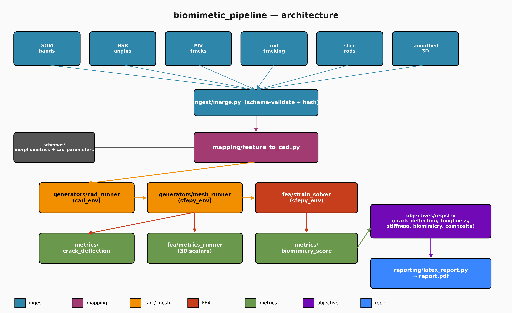

# biomimetic-lattice-pipeline

[](https://github.com/crentb/biomimetic-lattice-pipeline/actions/workflows/ci.yml)
[](LICENSE)
[](pyproject.toml)

Micro-CT–driven generation of **biomimetic enamel lattices** with finite-element-based design optimization.

The pipeline turns measured three-dimensional rod geometry from synchrotron micro-CT of tooth enamel into
**parametric CAD lattices**, runs **linear-elastic finite-element analysis (FEA)** on them, scores the results
against pluggable **objectives**, and can drive a **closed-loop Optuna optimization** that searches the
manufacturability-constrained design space — emitting a metrics JSON and a LaTeX/PDF report per run.

> This is the software behind the *Matter* manuscript *"Translating Helically Decussated Enamel into
> Damage-Tolerant Bioinspired Lattices"* (Renteria et al., in preparation).

## Architecture



A single canonical `morphometrics.json` is the only coupling point between stages, so each component can be
swapped independently:

```
ingest/        measured micro-CT morphometrics  ->  canonical morphometrics.json
mapping/       morphometrics  ->  CAD parameters (deterministic, with logged manufacturability clamps)
generators/    parametric continuous-twist CAD family + rod-by-rod digital-twin variants
fea/           strain-solver driving SfePy to a target representative stress
metrics/       crack-deflection streamlines, biomimicry score, SCF, toughness, ...
objectives/    YAML-configured, registry-based scoring (crack deflection, toughness, ...)
orchestration/ single-run, sweep, Optuna optimization, and closed-loop drivers
reporting/     LaTeX/PDF report generation
```

## Install

```bash
git clone https://github.com/crentb/biomimetic-lattice-pipeline.git
cd biomimetic-lattice-pipeline
python -m pip install -e ".[dev]"      # core runtime + dev tools (pytest, ruff, black)
```

Optional heavy geometry/visualization extras:

```bash
python -m pip install -e ".[fea]"      # pyvista, gmsh, meshio, scikit-image
```

> **Full FEA** additionally requires **CadQuery** and **SfePy** (installed via conda, as they are awkward to
> pip-install across platforms) plus the upstream stock CAD module from the parent `microct_pipeline` project.
> The default install and the CI exercise the **pure-Python design and analytics logic**; the heavy FEA/CAD
> path is gated behind the `slow` pytest marker.

## Quickstart

```bash
# End-to-end single-specimen run: morphometrics -> CAD -> mesh -> FEA -> metrics -> report
python scripts/run_pipeline.py --morphometrics path/to/morphometrics.json \
    --run-name demo --objective crack_deflection --model-type continuous_twist

# Parametric sweep over a single free CAD parameter
python scripts/run_sweep.py --morphometrics path/to/morphometrics.json \
    --run-name sweep_layers --param N_BRIDGE_LAYERS --values 4 6 8

# Closed-loop Optuna optimization of an objective
python scripts/run_optimize.py --morphometrics path/to/morphometrics.json \
    --run-name opt_cd --objective crack_deflection --n-trials 30
```

(See `scripts/` for the full set of CLI entry points.)

## Testing

```bash
pytest -m "not slow"      # fast, pure-Python logic tests (what CI runs)
pytest                    # everything, including the FEA integration test (needs the conda FEA stack)
```

## License

Apache-2.0 — see [LICENSE](LICENSE) and [NOTICE](NOTICE).

## Citation

A `CITATION.cff` will accompany the first tagged release; until then, please cite the *Matter* manuscript above.
